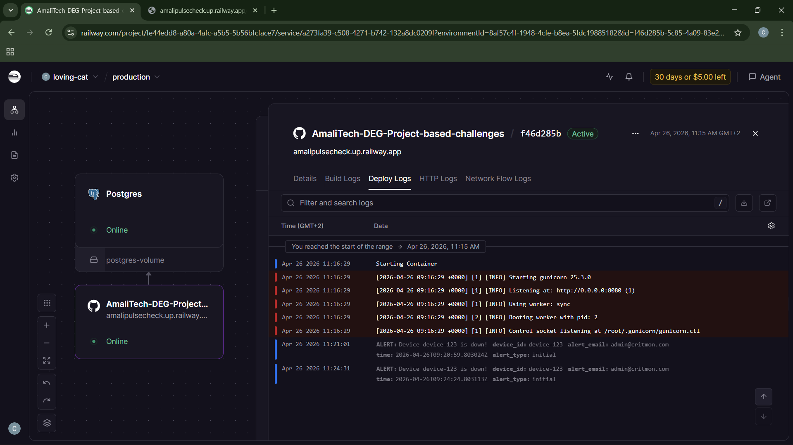
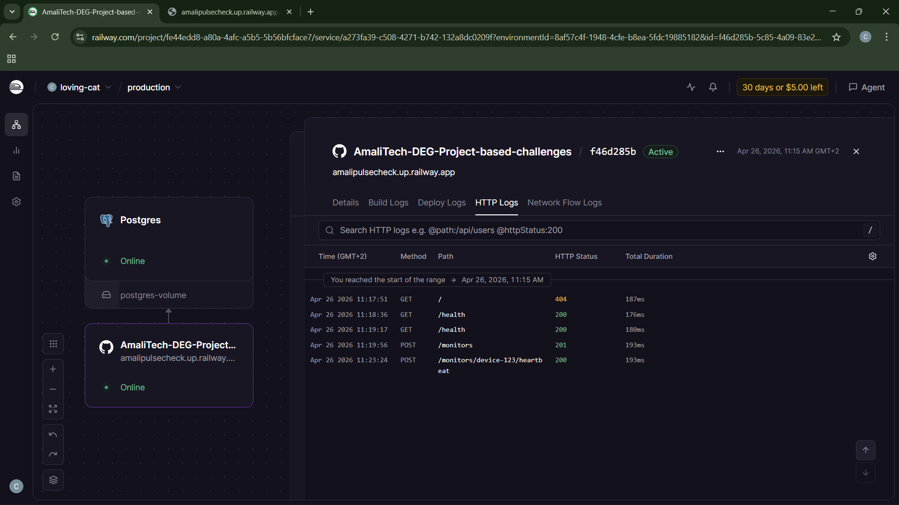
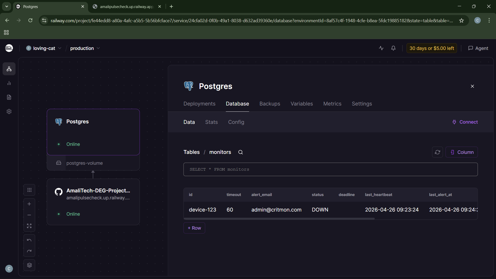

# Pulse-Check API (Watchdog Sentinel)

A Dead Man's Switch API for monitoring remote devices. Devices register with a countdown timer and must send periodic heartbeats to reset it. If a device goes silent, the system detects the absence and fires an alert.

Built for CritMon Servers Inc. to monitor remote solar farms and unmanned weather stations in low-connectivity areas.

---

## Architecture Diagram


Source Link: [https://drive.google.com/file/d/1Folxbc0rtolVg-QmOeNo6knG8NzeL0pk/view?usp=sharing](https://drive.google.com/file/d/1Folxbc0rtolVg-QmOeNo6knG8NzeL0pk/view?usp=sharing)

---

### State Machine

```
                 register
                    │
                    ▼
              ┌───────────┐
         ┌───►│  ACTIVE   │◄─── heartbeat (resets timer)
         │    └─────┬─────┘
         │          │
         │    ┌─────┴───────┐
         │    │             │
         │  pause      timeout expires
         │    │             │
         │    ▼             ▼
     heartbeat        ┌──────────┐
     (resume) ┌──────┐│   DOWN   │──── repeated alerts
         │    │PAUSED││          │     until recovery
         │    └──────┘└─────┬────┘
         │                  │
         └──── heartbeat ───┘
               (recover)
```

### How it works

There are four layers in the application:

**Routes** handle HTTP parsing and responses. No business logic.

**Service layer** makes all the decisions — state transitions, deadline math, validation.

**Models** define the schema and handle persistence via SQLAlchemy + SQLite (locally) or PostgreSQL (deployed).

**Scheduler** is a background thread (APScheduler) that wakes up every few seconds and runs a single query: "any ACTIVE monitors whose deadline is in the past?" Matches get marked DOWN and an alert is logged. This polling approach beats per-device timers because it scales to any fleet size with one query and survives server restarts since all state lives in the database.

---

## Setup

```bash
git clone https://github.com/PrincipieCyupe/AmaliTech-DEG-Project-based-challenges # Clone the repository
cd backend/Pulse-Check # CD inside the project

# Create a virtual environment to work in for this project (venv can be any name of your choice)
python3 -m venv venv
source venv/Scripts/activate # For windows, you may need different command for other OS

# Install the requirement packages and libraries for this project
pip install -r requirements.txt
python run.py # Start the server
```

Server starts on `http://localhost:5000`. The scheduler kicks in automatically.

### Environment Variables

| Variable | Default | What it does |
|---|---|---|
| `DATABASE_URL` | `sqlite:///pulse_check.db` | DB connection string |
| `SCHEDULER_CHECK_INTERVAL` | `5` | Polling frequency in seconds |
| `ALERT_REPEAT_INTERVAL` | `300` | Re-alert cooldown for DOWN monitors |

To test repeated alerts quickly:

```bash
ALERT_REPEAT_INTERVAL=30 python run.py
```

---

## Deployed Version

The API is deployed on Railway and accessible at:

```
https://amalipulsecheck.up.railway.app
```

All endpoints work the same way — just replace `http://localhost:5000` with the Railway URL:

```bash
curl https://amalipulsecheck.up.railway.app/health

curl -X POST https://amalipulsecheck.up.railway.app/monitors \
  -H "Content-Type: application/json" \
  -d '{"id": "device-123", "timeout": 60, "alert_email": "admin@critmon.com"}'

curl -X POST https://amalipulsecheck.up.railway.app/monitors/device-123/heartbeat
```

**Where do alerts show up when deployed?**

Locally, alerts print to the terminal where the server is running. On Railway, `print()` output goes to Railway's built-in log viewer. 
Here's the overview screenshot







---


## API Documentation

### 1. Health Check

**`GET /health`**

Returns server status. Used for liveness checks.

```bash
curl http://localhost:5000/health
```

**Response:**

 


---

### 2. Register a Monitor

**`POST /monitors`**

Register a new device with a countdown timer.

```bash
curl -X POST http://localhost:5000/monitors \
  -H "Content-Type: application/json" \
  -d '{"id": "device-123", "timeout": 60, "alert_email": "admin@critmon.com"}'
```

**Success (201 Created):**

 


**Duplicate ID (409 Conflict):**

```bash
curl -X POST http://localhost:5000/monitors \
  -H "Content-Type: application/json" \
  -d '{"id": "device-123", "timeout": 60, "alert_email": "admin@critmon.com"}'
```

 


**Validation Error (400 Bad Request):**

```bash
curl -X POST http://localhost:5000/monitors \
  -H "Content-Type: application/json" \
  -d '{"id": "", "timeout": 5, "alert_email": "not-an-email"}'
```

 


---

### 3. Send a Heartbeat

**`POST /monitors/{id}/heartbeat`**

Reset the countdown timer. Also un-pauses a PAUSED device and recovers a DOWN device.

```bash
curl -X POST http://localhost:5000/monitors/device-123/heartbeat
```

**Success (200 OK):**


**Device Not Found (404):**

```bash
curl -X POST http://localhost:5000/monitors/ghost-device/heartbeat
```


---

### 4. Pause a Monitor

**`POST /monitors/{id}/pause`**

Stop the timer completely. No alerts will fire while paused. Send a heartbeat to resume.

```bash
curl -X POST http://localhost:5000/monitors/device-123/pause
```

**Success (200 OK):**


**Trying to pause a DOWN device (400 Bad Request):**

```bash
curl -X POST http://localhost:5000/monitors/device-123/pause
```


---

### 5. List All Monitors

**`GET /monitors`**

Returns all monitors. Supports filtering by status.

```bash
curl http://localhost:5000/monitors
```

**Response (200 OK):**


**Filtered by status:**

```bash
curl "http://localhost:5000/monitors?status=ACTIVE"
```


---

### 6. Get a Single Monitor

**`GET /monitors/{id}`**

Get details for one specific device.

```bash
curl http://localhost:5000/monitors/device-123
```

**Response (200 OK):**


---

### 7. Timeout Alert (Device Goes Silent)

When a device fails to send a heartbeat before its timer runs out, the scheduler detects it and logs an alert to the console.

Register a device with a short timeout and do not heartbeat it:

```bash
curl -X POST http://localhost:5000/monitors \
  -H "Content-Type: application/json" \
  -d '{"id": "test-expire", "timeout": 15, "alert_email": "admin@critmon.com"}'
```

**Alert logged in server terminal after 15 seconds:**


---

### 8. Repeated Alerts (My chosen Feature)

If the device stays down, the system keeps firing alerts at a configurable interval. Start the server with a shorter cooldown to test:

```bash
ALERT_REPEAT_INTERVAL=30 python run.py
```

**Repeated alert logged in server terminal:**

Screenshot to be added!

**Recovery — sending a heartbeat stops the alerts:**

```bash
curl -X POST http://localhost:5000/monitors/test-expire/heartbeat
```


---

### 8. Database look

Database look with all monitors in the table


## My Chosen Feature: Repeated Alerts Until Recovery

### What

The base spec fires a single console alert when a device expires and then goes quiet. This feature makes the system keep alerting at a configurable interval for as long as the device stays down. Alerts carry an `"alert_type": "repeated"` tag to distinguish them from the initial one. They stop the moment the device sends a heartbeat.

### Why

A monitoring system that alerts once and goes silent is barely a monitoring system. If the on-call engineer is asleep when that one alert fires, the device stays down with zero follow-up. Repeated alerts act like a smoke alarm — they keep going until someone deals with the problem.

### How it works

Each monitor has a `last_alert_at` timestamp. When the scheduler marks a device DOWN, it sets this field. On every subsequent tick, it also checks for DOWN monitors whose `last_alert_at` is older than the configured `ALERT_REPEAT_INTERVAL`. Any match gets re-alerted and the timestamp resets. A heartbeat clears the field entirely, stopping the cycle.

---

## Project Structure

```
pulse-check-api/
├── run.py                     # entry point
├── requirements.txt
├── Procfile                   # railway deployment config
├── run.md                     # testing guide with curl commands
├── .gitignore
├── architecture_diagram.png
└── app/
    ├── __init__.py             # app factory
    ├── config.py
    ├── scheduler.py            # background timeout checker
    ├── schemas.py              # input validation
    ├── models/
    │   ├── __init__.py         # db instance
    │   └── monitor.py          # Monitor ORM model
    ├── routes/
    │   ├── __init__.py
    │   └── monitors.py         # endpoint handlers
    └── services/
        ├── __init__.py
        └── monitor_service.py  # business logic
```
